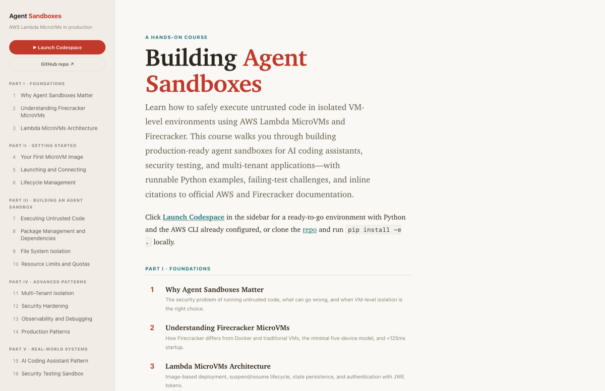

# Building Agent Sandboxes with AWS Lambda MicroVMs

Learn how to safely execute untrusted code in isolated environments using AWS Lambda MicroVMs and Firecracker. This course covers building production-ready agent sandboxes for AI coding assistants, security testing, and multi-tenant applications.

[](https://adamontherun.github.io/agent-sandboxes/)

[](https://adamontherun.github.io/agent-sandboxes/)

This repo is two things: **the book** (16 chapters of prose, nothing to install) and **the code** (runnable examples and failing-test challenges, which need an environment). Every chapter in the book links straight back to Codespaces, so you're never more than one click from a terminal with Python and the AWS CLI already installed.

## What's covered

- **Part I · Foundations** — Why agent sandboxes matter, Firecracker architecture, and Lambda MicroVMs design
- **Part II · Getting Started** — Building your first MicroVM image, launching instances, and lifecycle management
- **Part III · Building an Agent Sandbox** — Code execution, package management, filesystem isolation, and resource limits
- **Part IV · Advanced Patterns** — Multi-tenant isolation, security hardening, observability, and production deployment
- **Part V · Real-World Systems** — AI coding assistant and security testing sandbox patterns

## Setup

Don't want to install anything? Open [the book](https://adamontherun.github.io/agent-sandboxes/) and click "Launch Codespace" in any chapter's sidebar — it opens a cloud dev environment with Python and the AWS CLI already installed.

To run locally, you need [Python 3.11+](https://www.python.org/downloads/) and [the AWS CLI](https://aws.amazon.com/cli/):

```sh
# Install dependencies
pip install -e .

# Configure AWS credentials (requires Lambda MicroVMs access)
aws configure
```

**Note**: Lambda MicroVMs is a preview feature. You'll need AWS account access and appropriate IAM permissions to run the examples against real infrastructure. Many examples also ship an offline simulation path so you can follow along without an AWS account. Examples use the `us-east-1` region by default.

## Doing challenges

Every chapter has a challenge under `challenges/`: a skeleton file with failing tests. Edit the skeleton until the tests pass:

```sh
pytest challenges/ch04_test.py
```

Reference solutions live in `solutions/`. No peeking until the tests pass.
